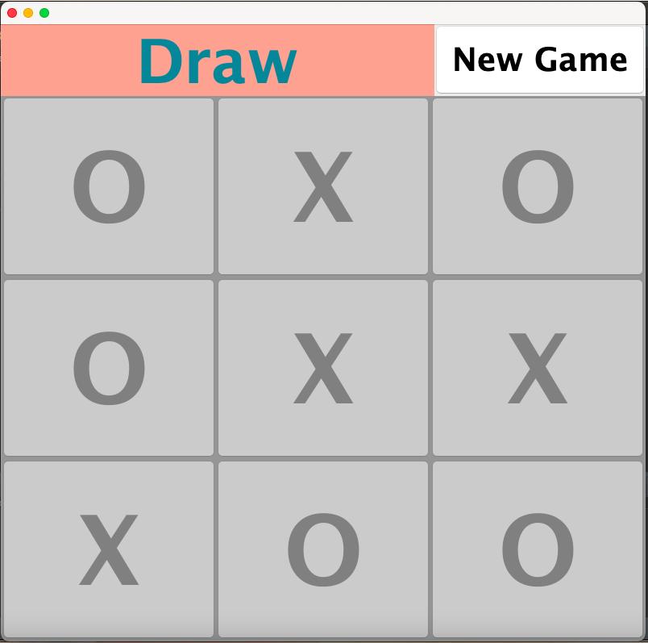
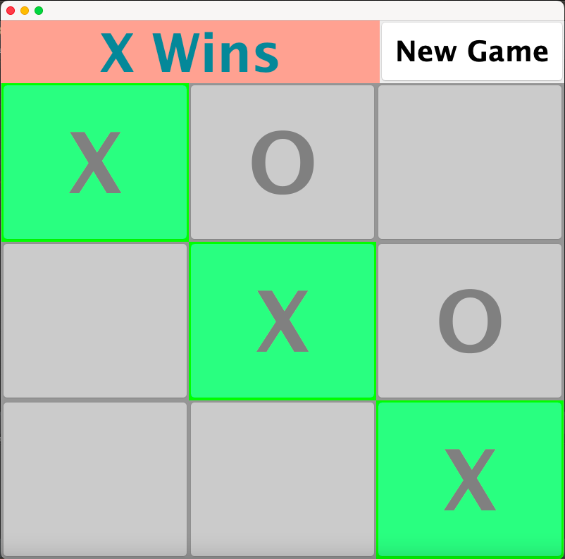

# ❌⭕ TicTacToe Game (Java)
## 📄 Project Overview
This is a GUI-based TicTacToe game built in Java using Swing.
The game allows two players to play on the same computer, provides a visual interactive board, detects wins, draws, and allows restarting the game.

## ✨ Features
- Two-player gameplay on the same computer
- Win detection for rows, columns, and diagonals
- Draw detection
- Restart / New Game button to reset the board
- GUI interface using Swing components
- Highlights winning combination in green

## 🖱 How to Play
- Clone the repository or download the files.
- Open the project in Eclipse or any Java IDE.
- Run the TicTacToe.java file.
- Players take turns clicking on empty squares to place X or O.
- The game announces the winner automatically or shows a draw if the board is full.
- Press New Game to restart the board at any time.

## 🖼 Screenshots

## ⚙ How it Works
- Randomly selects the first turn (X or O).
- Players take turns clicking buttons to place their symbol.
- The game checks for a win after every move.
- When a player wins, the winning line is highlighted in green and buttons are disabled.
- If all cells are filled without a winner, the game declares a draw.

## 📝 Requirements
- Java JDK (version 8 or higher)
- Any Java IDE (Eclipse, IntelliJ IDEA, NetBeans)
